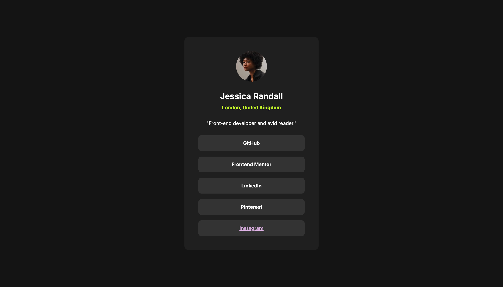

# Frontend Mentor - Social links profile solution

This is a solution to the [Social links profile challenge on Frontend Mentor](https://www.frontendmentor.io/challenges/social-links-profile-UG32l9m6dQ). Frontend Mentor challenges help you improve your coding skills by building realistic projects. 

## Table of contents

- [Overview](#overview)
  - [The challenge](#the-challenge)
  - [Screenshot](#screenshot)
  - [Links](#links)
- [My process](#my-process)
  - [Built with](#built-with)
  - [What I learned](#what-i-learned)
  - [Continued development](#continued-development)
  - [Useful resources](#useful-resources)
- [Author](#author)

## Overview

### The challenge

Users should be able to:

- See hover and focus states for all interactive elements on the page

### Screenshot


Add a screenshot of your solution. The easiest way to do this is to use Firefox to view your project, right-click the page and select "Take a Screenshot". You can choose either a full-height screenshot or a cropped one based on how long the page is. If it's very long, it might be best to crop it.

Alternatively, you can use a tool like [FireShot](https://getfireshot.com/) to take the screenshot. FireShot has a free option, so you don't need to purchase it. 

Then crop/optimize/edit your image however you like, add it to your project, and update the file path in the image above.

**Note: Delete this note and the paragraphs above when you add your screenshot. If you prefer not to add a screenshot, feel free to remove this entire section.**

### Links

- Solution/Live Site URL: [https://cocoelizabeth.github.io/frontendmentor-social-links-profile/](https://cocoelizabeth.github.io/frontendmentor-social-links-profile/)

## My process

### Built with

- Semantic HTML5 markup
- CSS custom properties
- Flexbox
- Mobile-first workflow

### What I learned

**Applying the CSS for the hover, focus and active states of the social links**\

Initially, I was having issues getting the color of the text in the `<a>` tags to change when I hovered over the `<li>` elements. I could get the background to change but the text  (which was wrapped in an `<a>` tag inside the `<li>`) was only changing color if I directly hovered over the text, not if I hovered over the `<li>` outside of the text. To fix this, I adjusted the CSS so that the `<a>` tag inside the `<li>` filled the entire space of the `<li>`. This way, hovering anywhere over the `<li>` will trigger the hover effect defined for the `<a>` tag.\
 
Here are the specific adjustments that I made to the css: 
1. Set the `<a>` tag to `display:block` in order to make the `<a>` tag fill the entire space of its parent `<li>` element.
2. Moved the padding from the `<li>` to the `<a>` tag. Since the `<a>` tag is now a block element, it can handle padding, margins, and other box-model properties.
3. Applied the `:hover`, `:active`, and `:focus` pseudo-classes directly to the `<a>` tags. This change guaranteed that both the background and text color changes would be visible when any part of the `<li>` was hovered over, not just the text.

Here is the relevant html and CSS code:

```html
<li class="social-link-item m-t-200">
  <a
    class="social-link-item-text text-preset-2 bold"
    href="https://github.com/cocoelizabeth"
    target="_blank"
    aria-label="Visit my GitHub profile"
  >GitHub</a
  >
</li>
```
```css
.social-link-item {
  width: 100%;
  list-style: none;
}

.social-link-item a {
  text-decoration: none;
  display: block;
  background-color: var(--color-grey-700);
  text-align: center;
  border-radius: 8px;
  padding: var(--spacing-150);
  transition: background-color 600ms ease-in, color 600ms ease-in;
}

.social-link-item a:hover,
.social-link-item a:active,
.social-link-item a:focus {
  background-color: var(--color-green);
  color: var(--color-grey-700);
  cursor: pointer;
  outline: none;
}
```

### Continued development

One thing I would like to fix in the future is an issue that I had with the Instagram link.

For some reason, when I used the link `href="https://www.instagram.com/coco.elizabeth_/"`, the browser added inline styling (color and text-decoration) to the `<a>` tag for the instagram social link item. I couldn't find anything online about why this was happening but it happened to me in both Chrome and Safari, and it happen on my local server as well as when I published the project on GitHub Pages.

**Here is a screenshot of what was happening:**\
*(Notice the purple, underlined instagram link)*


**This is the HTML I was getting when I inspected the code:**\
*(Notice the added  `style`  attribute, which was not added to any of the other links)*
```html
<li class="social-link-item m-t-200">
   <a 
     class="social-link-item-text text-preset-2 bold" 
     href="https://www.instagram.com/coco.elizabeth_/" 
     target="_blank" 
     aria-label="Follow me on Instagram" 
     style="color: rgb(206, 167, 212); text-decoration: underline;">Instagram</a>
</li>
```
**Things I tried to fix it:**
1. Setting a `:visited` CSS pseudo-class in the CSS - *This did not work.*
2. Tested it in different browsers (Chrome and Safari). - *It was happening in both browsers*
3. Changing the order of the `<li>` elements so that the instagram link was not last to see if this was something only happening to the "last child". - *This did not fix the issue. It was still happening for the instagram link and not for any of the others.*
3. Pushing the site live to GitHub pages to see if maybe it was just an issue with my local server - *This didn't fix the issue*

**Ultimate solution/workaround:**\
To fix the issue, I used a URL shortener and replaced the link with the shortened URL: `href="https://tinyurl.com/coco-elizabeth-intsa"`.
 
While this workaround fixed the issue, I am still confused about why it was happening. If anyone has any ideas of what would have caused this, please let me know!

### Useful resources

- [Flexbox Froggy](https://flexboxfroggy.com/) - This is a fun, interactive way to learn CSS Flexbox. I used this tool to better understand how to use Flexbox for layout adjustments, which was crucial for this project. It's a great resource for anyone looking to sharpen their Flexbox skills in a playful and engaging manner.
- [Google Fonts](https://fonts.google.com/) - This is a great resource for finding and integrating different fonts.


## Author

<!-- - Website - [Add your name here](https://www.your-site.com) -->
- Frontend Mentor - [@cocoelizabeth](https://www.frontendmentor.io/profile/cocoelizabeth)
<!-- - Twitter - [@yourusername](https://www.twitter.com/yourusername) -->
